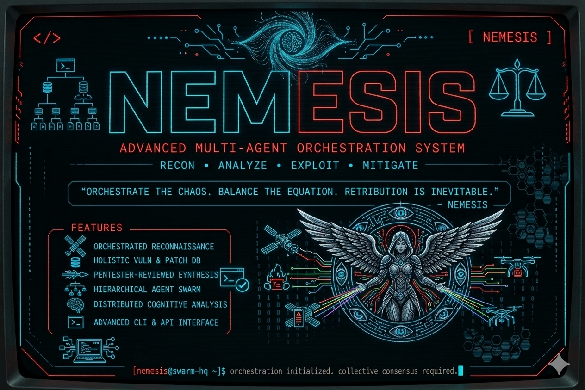
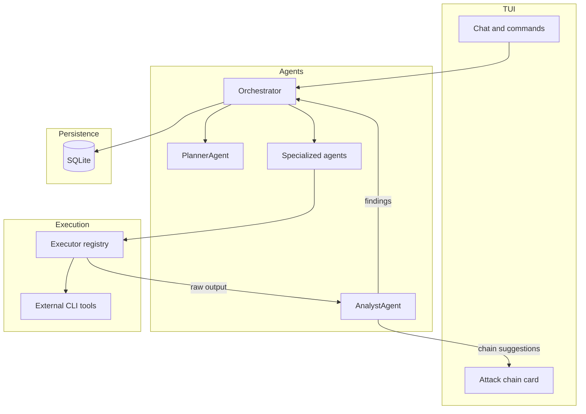

# NEMESIS



[](https://www.python.org)
[](LICENSE)
[](https://textual.textualize.io/)
[](https://github.com/BerriAI/litellm)
[](https://ollama.com)

**AI-assisted penetration testing, not an autonomous hacker,. Your expert analyst, always at your side.**

---

## Table of contents

- [Screenshots](#screenshots)
- [What is NEMESIS?](#what-is-nemesis)
- [Key features](#key-features)
- [How it works (orchestration)](#how-it-works-orchestration)
- [Requirements](#requirements)
- [Installation](#installation)
- [LLM configuration](#llm-configuration)
- [Quick start](#quick-start)
- [Usage](#usage)
- [Project structure](#project-structure)
- [Roadmap](#roadmap)
- [Contributing](#contributing)
- [Disclaimer](#disclaimer)
- [License](#license)

---

## Screenshots

Drop in-app captures here to show the TUI (main layout, chat, attack-chain card, etc.). Use **sanitized** screenshots only — no real client names, scoped targets, credentials, or raw tool output from live engagements.

<!-- Example (uncomment and add files under docs/screenshots/):


-->

---

## What is NEMESIS?

NEMESIS is a terminal-based AI co-pilot for penetration testers. It is powered by **LiteLLM** — an abstraction layer that supports many AI providers. By default it runs a local model via **Ollama**: no cloud, no API keys, no data leaving your machine. You can also opt into remote providers (OpenAI, Anthropic, etc.) or any OpenAI-compatible endpoint via environment variables.

Unlike fully autonomous tools, NEMESIS follows the **assisted pentest** philosophy: **you drive, the AI assists**. You make the strategic decisions; NEMESIS handles memory, analysis, false-positive filtering, and finding correlation across your entire engagement.

Think of it as **Cursor, but for penetration testing**.

```
You:     "found this nmap output, what stands out?"
NEMESIS: "Apache 2.4.49 on port 80 — CVE-2021-41773 path traversal (CRITICAL).
          Want me to verify with a PoC before we continue enumerating?"
You:     "yes"
NEMESIS: [runs verification] "Confirmed. LFI works. Document and move on, or exploit now?"
```

---

## Key features

- **Project-based memory** — every scan, finding, and decision is stored per engagement. Resume later and the AI picks up where you left off.
- **Structured attack plans** — the **Planner** proposes multi-step plans (tools, specialized agents, dependencies). You stay in control in **Auto**, **Step**, or **Manual** modes.
- **Specialized agents** — role-specific executors (recon, scanning, enumeration, vulnerability) plus dedicated **Nuclei** and **ffuf** agents, each constrained to relevant tools from the live registry.
- **Kali-aligned tool manifest** — `nemesis/tools/kali_tools.yml` describes a large catalog of CLI tools (phases, defaults, install hints). Per-agent **allowlists** keep LLM prompts focused and safe.
- **Analyst in the loop** — raw subprocess output is never fed blindly to the model for decisions. The **Analyst** filters noise, scores confidence, and correlates findings. Findings progress **RAW → UNVERIFIED → VALIDATED/DISMISSED** before reporting.
- **Attack chain suggestions** — after new findings, the UI can surface **Suggested next steps**; pick with keyboard shortcuts or dismiss when you want a different path.
- **Destructive action gates** — risky actions require explicit confirmation and are logged for audit trails.
- **100% local by default** — Ollama + LiteLLM out of the box; remote providers are opt-in via configuration.
- **Cyberpunk TUI** — panels, streaming output, and a chat-first workflow.

---

## How it works (orchestration)

High-level flow: your messages hit the **Orchestrator**, which plans with the **Planner**, runs work through **specialized agents** and the **Executor** registry, and routes **raw** tool output through the **Analyst** before persisting **findings** and updating the TUI (including optional **attack chain** suggestions).



---

## Requirements

- Python 3.11+
- [uv](https://docs.astral.sh/uv/) package manager
- [Ollama](https://ollama.com) — default local model backend (for offline/local use)
- Linux (Kali, Parrot, Ubuntu) or macOS

NEMESIS uses **LiteLLM** as its AI layer; Ollama is the default for air-gapped workflows. Remote or OpenAI-compatible endpoints are configured via environment variables (see [LLM configuration](#llm-configuration)).

**Recommended Ollama model:**

```bash
ollama pull llama3.1:8b
```

For systems with limited RAM:

```bash
ollama pull llama3.2:3b
```

**System tools** (install what you need for your workflow; examples below match common integrations):

```bash
# Debian/Ubuntu/Kali/Parrot
sudo apt install nmap whois dnsutils nikto gobuster amass nuclei ffuf

# macOS (Homebrew)
brew install nmap whois gobuster amass nuclei ffuf
```

`curl` is optional and useful for manual checks and future integrations.

---

## Installation

```bash
# 1. Clone the repository (replace URL with your fork or upstream)
git clone https://github.com/your-username/nemesis.git
cd nemesis

# 2. Install dependencies with uv
uv sync

# 3. Start Ollama (default local AI backend) and pull a model
ollama serve &
ollama pull llama3.1:8b

# 4. Launch NEMESIS
uv run nemesis
```

Ensure `banner.png` lives next to `README.md` if you want the header image to render on GitHub.

---

## LLM configuration

NEMESIS loads LLM settings from environment variables. You can set them in your shell
or put them in an optional `.env` file.

### Environment variables


| Variable              | Default                  | Example                                                                       |
| --------------------- | ------------------------ | ----------------------------------------------------------------------------- |
| `NEMESIS_MODEL`       | `ollama/llama3.1:8b`     | `openai/gpt-4o`, `anthropic/claude-3-5-sonnet-20241022`, `ollama/qwen2.5:72b` |
| `NEMESIS_BASE_URL`    | `http://localhost:11434` | `https://api.openai.com/v1`, `http://localhost:1234/v1`                       |
| `NEMESIS_API_KEY`     | `""`                     | `sk-...`                                                                      |
| `NEMESIS_TEMPERATURE` | `0.3`                    | `0.1`                                                                         |
| `NEMESIS_MAX_TOKENS`  | `2048`                   | `4096`                                                                        |
| `NEMESIS_TIMEOUT`     | `60`                     | `120`                                                                         |


LiteLLM also supports provider-specific environment variables such as `OPENAI_API_KEY` and
`ANTHROPIC_API_KEY`.

### Optional `.env` file

If a `.env` file exists, NEMESIS will load it from:

- the current working directory: `./.env`
- or the repository root (when running from a source checkout)

Values already present in the process environment are **not overwritten** by `.env`. This means
operators can always override any `.env` value via shell exports.

### Examples

**Ollama local (default)**

```bash
uv run nemesis
```

**Ollama local with a different model**

```bash
NEMESIS_MODEL=ollama/qwen2.5:72b uv run nemesis
```

**OpenAI**

```bash
NEMESIS_MODEL=openai/gpt-4o \
NEMESIS_BASE_URL=https://api.openai.com/v1 \
OPENAI_API_KEY=sk-... \
uv run nemesis
```

**OpenAI-compatible endpoint (LM Studio / vLLM / etc.)**

```bash
NEMESIS_MODEL=openai/mistral-nemo \
NEMESIS_BASE_URL=http://localhost:1234/v1 \
NEMESIS_API_KEY=sk-... \
uv run nemesis
```

---

## Quick start

```
$ uv run nemesis

[NEMESIS boots with splash screen]

[nemesis] Welcome. No active project.
          Start a new engagement? (n) or load existing? (l)

> n

[nemesis] Target? (IP, domain, CIDR — or comma-separated list, within scope)

> <your in-scope targets>

[nemesis] Got it. Any context about this engagement? (optional)
          e.g. client type, objectives, restrictions, rules of engagement

> e-commerce company, focus on web app, no destructive tests

[nemesis] Understood. Prioritizing web surface for e-commerce.
          Will avoid actions that could cause downtime.
          Payment flows and authentication will get extra attention.

          Ready. What do you want to do?

> run initial recon on <target>

[nemesis] Starting recon: nmap -sV -sC, whois, DNS enum...
          [████████████░░░░] running...
```

---

## Usage

### Control modes

Set your preferred control mode at any time:

```
> mode auto    — AI executes full plans autonomously
> mode step    — AI proposes each action, you approve (default)
> mode manual  — you direct every command, AI only analyzes
```

### Useful commands

```
> new project          — start a new engagement
> load project         — switch to an existing project
> status               — show current project, phase, and findings
> findings             — list all validated findings
> plan                 — show the current attack plan
> report               — generate PDF/HTML report
> help                 — show all available commands
```

### Chat interface

Just talk to NEMESIS in natural language:

```
> what's the most critical finding so far?
> run gobuster with a medium wordlist
> is this nikto output a false positive? [paste output]
> what attack paths can we chain from these findings?
> generate the executive summary section
```

---

## Project structure

```
nemesis/
├── nemesis/
│   ├── main.py              # entry point
│   ├── tui/                 # terminal UI (Textual)
│   │   ├── app.py
│   │   ├── theme.tcss
│   │   ├── screens/         # splash, main, new_project
│   │   └── widgets/         # chat, context, task_list, attack_chain, status_bar, …
│   ├── core/                # domain models, config, project state
│   ├── agents/              # orchestrator, analyst, planner, executor, specialized agents
│   │   └── specialized/     # recon, scanning, enumeration, vulnerability, nuclei, ffuf
│   ├── db/                  # SQLite async persistence
│   └── tools/               # tool registry, kali_tools.yml, agent_allowlist
├── scripts/
│   └── update_kali_manifest.py   # refresh Kali tool manifest from upstream metadata
├── tests/
├── pyproject.toml
├── banner.png               # README header image (repo root)
└── README.md
```

Optional: add screenshots under `docs/screenshots/` and reference them from the [Screenshots](#screenshots) section.

---

## Roadmap

**Shipped**

- TUI, project model, SQLite persistence, session phases
- Orchestrator with LiteLLM / Ollama and opt-in remote providers
- Planner with structured multi-step attack plans
- Specialized agents (recon, scanning, enumeration, vulnerability, **nuclei**, **ffuf**) backed by the tool registry and allowlists
- Analyst: noise filtering, confidence scoring, correlation; attack-chain suggestions in the UI
- Kali-aligned tool manifest (`kali_tools.yml`) with maintenance script

**Next**

- Additional first-class tool integrations (e.g. sqlmap, searchsploit, theHarvester)
- Report generation (PDF / HTML) polish
- Plugin or extension model for custom tools and workflows

---

## Contributing

Contributions are welcome. Please open an issue before submitting large PRs to discuss the approach.

1. Fork the repository
2. Create a feature branch (`git checkout -b feature/your-feature`)
3. Follow the coding standards in `.cursor/rules/`
4. Run linting: `uv run ruff check && uv run ruff format`
5. Run tests: `uv run pytest`
6. Submit a PR with a clear description

---

## Disclaimer

**NEMESIS is intended exclusively for authorized penetration testing and security research.**

- Only use NEMESIS against systems you own or have **explicit written authorization** to test.
- Unauthorized scanning, enumeration, or exploitation of computer systems is **illegal** in most jurisdictions and can result in criminal prosecution.
- The authors are not responsible for any misuse of this tool.
- Always obtain proper written authorization (e.g., a Rules of Engagement document) before testing any system.

---

## License

MIT License — see [LICENSE](LICENSE) for details.
